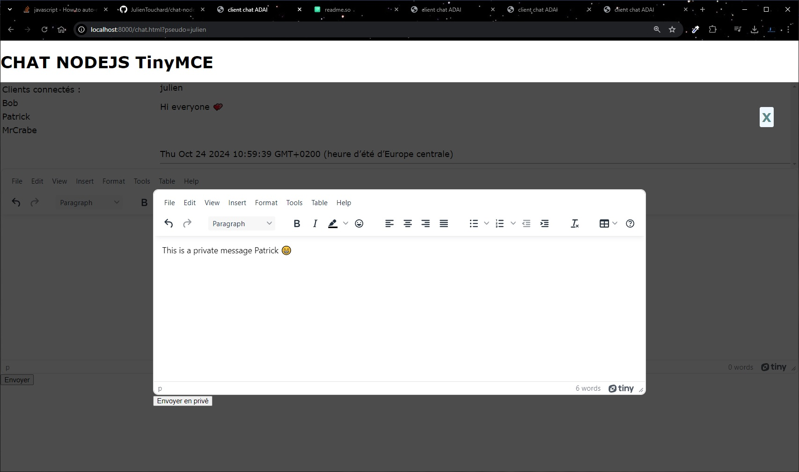

# NodeJS project - Chat with nodeJS and TinyMCE

I am a web development trainer, and the majority of the following repositories are educational project intended for my students. Feel free to use them, but please read the comments ... no copy/pasting without understanding 😜!


## 📷 Screenshots




## ⚙ Installation

Clone the project in your forlder

```bash
  git clone https://github.com/JulienTouchard/chat-nodeJS-tinyMCE.git
```
Install the chat nodejs with nodejs and npm

```bash
  npm update
```
Start the server
```bash
  nodemon app.js
```
    
## 🛠 languages and tools:

|  |  |  |  |
|---|---|---|---|
| |  |  |  |
|  |  |  |  |
|  | | | |
|---|---|---|---|


## Find me on ...

- [linkedin](https://www.linkedin.com/in/julien-touchard-dev/)
- [julien-touchard.com](https://www.julien-touchard.com/)
- [deeps.fr](https://www.deeps.fr/)
## 👋 See you soon 

...